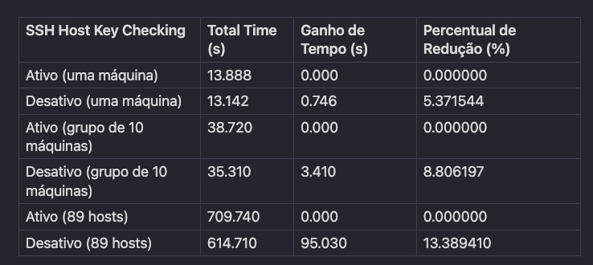

## Motivação

```js eval
<p className="text-2xl font-sans text-purple-400 dark:text-purple-500">
  <i>Fala, rapeize!!!</i>
</p>
```

Estou na saga de conseguir fazer com que os meus playbooks sejam executados mais rapidamente, então resolvi compartilhar com vocês esses sete passos que me levaram a reduzir drasticamente o tempo de execução, principalmente em parques com muitas máquinas para gerenciar e configurar.

---

## Pré-requisitos

- Conhecimentos básicos de Ansible e arquitetura.
- Ter máquinas para testar o playbook, quanto mais, melhor.

---

## Desabilitar o SSH Host Key Checking

Ao iniciar um playbook, o Ansible faz uma conexão SSH com o host remoto. Um dos passos antes da autenticação é a checagem da chave SSH. Esse procedimento requer uso de rede e I/O.

Seu playbook pode ter melhor desempenho se os hosts estiverem em uma rede com alta latência, pois o tempo de verificação da chave do host pode ser mais perceptível. Isso se agrava dependendo da quantidade de hosts que você vai usar no seu playbook.

O tempo pode variar dependendo do desempenho do I/O do sistema.

### Desabilitando via ENV

```shell
export ANSIBLE_HOST_KEY_CHECKING=False
```

### Desabilitando via `ansible.cfg`

```ini
[defaults]
host_key_checking = False
```

### Desabilitando no `inventário`

```
[all:vars]
ansible_ssh_hosts_key_checking=False
```

### Desabilitando em um host específico

```
[guelo_hosts]
10.10.0.2 ansible_ssh_host_key_checking=False
```
---

## Testes práticos

Primeiro, vamos baixar o código necessário para os testes:

```
git clone https://github.com/fbrunoviana/tunning-ansible.git
cd OtimizarPlaybook/
```

O comando `time` é usado para medir o tempo de execução de um comando no linux, e será usado como contador nos testes.
#### Teste: Uma máquina

*Check Habilitado:*

```bash
time ansible-playbook -i 192.168.0.14, --user root --extra-vars "ansible_ssh_pass='sua_senha'" lerolero.yaml

ansible-playbook -i 192.168.0.14, --user root --extra-vars lerolero.yaml 1.82s user 0.75s system 18% cpu 13.888 total
```

*Check Desabilitado:* 

```bash
ANSIBLE_HOST_KEY_CHECKING=False

time ansible-playbook -i 192.168.0.14, --user root --extra-vars "ansible_ssh_pass='sua_senha'" lerolero.yaml

ansible-playbook -i 192.168.0.14, --user root --extra-vars lerolero.yaml 1.72s user 0.71s system 18% cpu 13.142 total
```

**Comparação**

- **Ativo**: 13.888 segundos
- **Desativo**: 13.142 segundos
- **Ganho de Tempo**: 0.746 segundos
- **Percentual de Redução**: 5.37%

#### Teste: Dez máquinas

*Check Habilitado:*

```bash
time ansible-playbook -i 192.168.0.{10-19}, --user root --extra-vars "ansible_ssh_pass='sua_senha'" lerolero.yaml

ansible-playbook -i 192.168.0.14, --user root --extra-vars lerolero.yaml 6.36s user 5.05s system 29% cpu 38.720 total
```

*Check Desabilitado:* 

```bash
ANSIBLE_HOST_KEY_CHECKING=False

time ansible-playbook -i 192.168.0.{10-19}, --user root --extra-vars "ansible_ssh_pass='sua_senha'" lerolero.yaml

ansible-playbook -i 192.168.0.{10-19}, --user root --extra-vars lerolero.yaml 5.72s user 5.07s system 30% cpu 35.310 total
```

**Comparação entre grupo de 10 máquinas**

- **Ativo**: 38.720 segundos
- **Desativo**: 35.310 segundos
- **Ganho de Tempo**: 3.410 segundos

#### Teste: Oitenta e nove máquinas

*Check Habilitado:*

```bash
time ansible-playbook -i 192.168.0.{10-98}, --user root --extra-vars "ansible_ssh_pass='sua_senha'" lerolero.yaml

ansible-playbook -i 192.168.0.{10-98}, --user root --extra-vars lerolero.yaml 6.36s user 5.05s system 29% cpu 38.720 total
```

*Check Desabilitado:* 

```bash
ANSIBLE_HOST_KEY_CHECKING=False

time ansible-playbook -i 192.168.0.{10-98}, --user root --extra-vars "ansible_ssh_pass='sua_senha'" lerolero.yaml

ansible-playbook -i 192.168.0.{10-98}, --user root --extra-vars lerolero.yaml 70.51s user 51.51s system 19% cpu 10:14.71 total
```

**Comparação entre 89 hosts**

- **Ativo**: 709.74 segundos
- **Desativo**: 614.71 segundos
- **Ganho de Tempo**: 95.03 segundos
- **Percentual de Redução**: 13.39%

#### Resultado compilado



O impacto da desativação do SSH host key checking cresce com o aumento do número de máquinas. Enquanto o ganho é modesto para poucas máquinas, ele se torna bastante significativo para grandes grupos, chegando a até 13.38% de ganho com a desativação.

---

## Conclusão

Embora a desativação do SSH host key checking possa melhorar o desempenho, é importante considerar os trade-offs de segurança. A verificação da chave do host ajuda a garantir que as conexões SSH são seguras e autênticas. Desativar essa verificação pode expor o ambiente a ataques man-in-the-middle, especialmente em redes não confiáveis.

É importante considerar a velocidade da desabilitação desse recurso do SSH que, apesar de modesto, pode economizar tempo.

